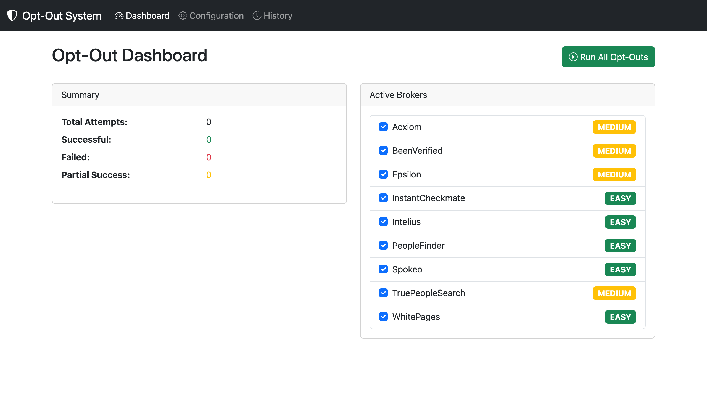
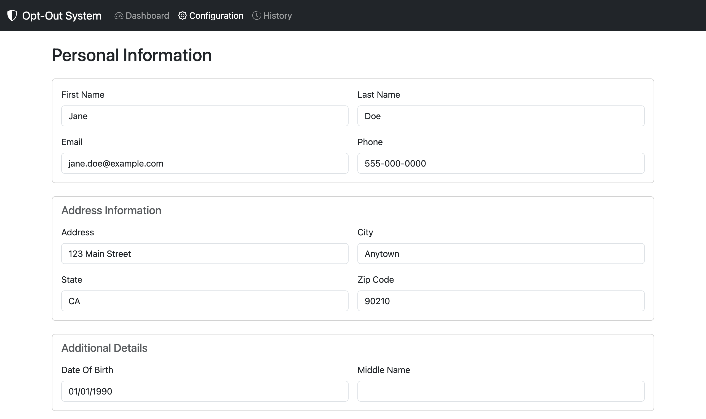
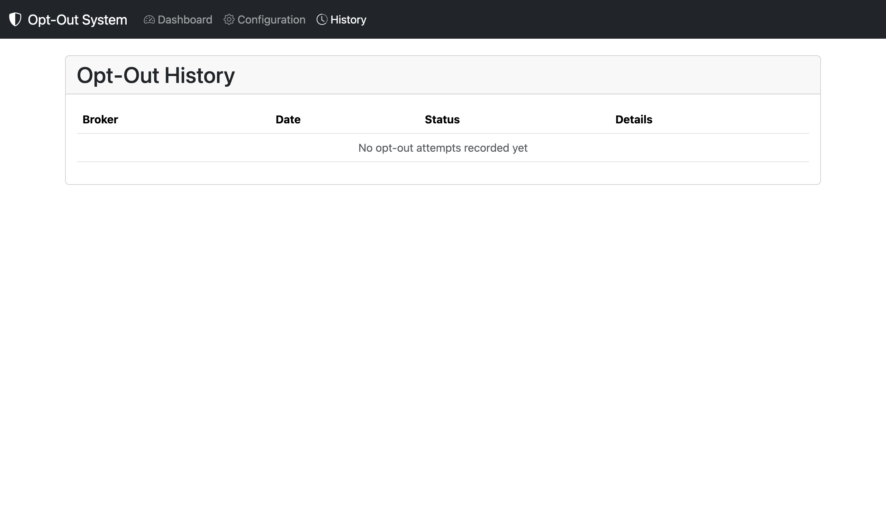

# 🛡️ data-broker-optout

> **Automate opt-out requests across 20+ data broker and people-search websites from a clean local web UI.**

Data brokers collect and sell your personal information — name, address, phone number, relatives, employment history, and more — without your consent. This tool automates the tedious process of submitting opt-out/removal requests to as many of them as possible, logs every attempt, and re-submits on a 90-day schedule so your data keeps getting removed as brokers periodically re-add it.

[](https://python.org)
[](https://flask.palletsprojects.com)
[](https://selenium.dev)
[](LICENSE)

---

## Screenshots

### Dashboard



### Configuration



### History



---

## Features

| Feature | Detail |
|---|---|
| **20+ data brokers** | Spokeo, WhitePages, BeenVerified, Intelius, TruePeopleSearch, Acxiom, Epsilon, LexisNexis, InstantCheckmate, and more |
| **Web dashboard** | Start batch runs, watch live per-broker progress, review full attempt history |
| **Headless Chrome** | Selenium runs Chrome invisibly in the background |
| **Auto-reschedule** | Automatically reruns every 90 days — brokers regularly re-add your data |
| **Local-only** | All your personal info stays on your machine — SQLite DB + local config file |
| **Live progress modal** | Real-time progress bar shows current broker while the batch runs |
| **Configurable via UI** | Update your personal information directly in the browser — no file editing required |
| **CLI mode** | Run headless batch jobs or check status from the terminal |

---

## Quick Start

### Requirements

- Python 3.9+
- Google Chrome (ChromeDriver is downloaded automatically)

### Install

```bash
# 1. Clone
git clone https://github.com/RhythrosaLabs/data-broker-optout.git
cd data-broker-optout

# 2. Create a virtual environment
python3 -m venv .venv
source .venv/bin/activate        # Windows: .venv\Scripts\activate

# 3. Install dependencies
pip install -r requirements.txt

# 4. Set up your configuration
cp config.json.example config.json
# Edit config.json — this file is gitignored and never committed
```

### Run

```bash
cd src
python -m broker_app
```

Open **http://127.0.0.1:5000** in your browser.

---

## Configuration

Copy `config.json.example` to `config.json` and fill in your real details.  
`config.json` is in `.gitignore` — **it is never committed**.

```json
{
  "personal_info": {
    "first_name":    "Jane",
    "last_name":     "Doe",
    "email":         "jane@example.com",
    "phone":         "555-000-0000",
    "address":       "123 Main Street",
    "city":          "Anytown",
    "state":         "CA",
    "zip_code":      "90210",
    "date_of_birth": "01/01/1990",
    "middle_name":   ""
  },
  "bot_settings": {
    "headless":       true,
    "delay_min":      2,
    "delay_max":      5,
    "timeout":        30,
    "retry_attempts": 3
  }
}
```

You can also update all fields at any time through the **Configuration** page in the web UI — it saves back to `config.json` automatically.

### Environment variables

| Variable | Default | Purpose |
|---|---|---|
| `SECRET_KEY` | random token | Flask session secret — set a stable value for long-running deployments |
| `BROKER_CONFIG` | `config.json` in repo root | Override the config file path |
| `FLASK_DEBUG` | `0` | Set to `1` to enable debug mode |

---

## CLI Reference

```bash
cd src && python -m broker_app [options]

  --port INT      Port to listen on (default: 5000)
  --host TEXT     Bind address (default: 127.0.0.1 = localhost only)
  --debug         Enable Flask debug mode
```

The CLI module in `src/broker_app/cli.py` also exposes standalone commands:

```bash
python -m broker_app.cli --list-brokers       # list all registered brokers
python -m broker_app.cli --status             # print attempt summary
python -m broker_app.cli --run-batch          # headless batch run
python -m broker_app.cli --run-batch --headless --brokers "Spokeo,WhitePages"
```

---

## Supported Data Brokers

| Broker | Difficulty | Email Verification |
|---|---|---|
| Spokeo | Easy | ✅ Required |
| WhitePages | Easy | — |
| BeenVerified | Medium | ✅ Required |
| PeopleFinder | Easy | — |
| Intelius | Easy | ✅ Required |
| TruePeopleSearch | Medium | ✅ Required |
| FastPeopleSearch | Medium | ✅ Required |
| CheckPeople | Easy | — |
| USSearch | Easy | ✅ Required |
| PeopleSearchNow | Medium | ✅ Required |
| Acxiom | Medium | — |
| Epsilon | Medium | — |
| LexisNexis | Hard | ✅ Required |
| InstantCheckmate | Easy | ✅ Required |
| MyLife | Hard | ✅ Required |
| PeekYou | Medium | ✅ Required |
| Radaris | Medium | ✅ Required |
| ThatsThem | Easy | ✅ Required |
| PublicRecordsNow | Easy | ✅ Required |
| 192.com *(UK)* | Medium | ✅ Required |

> After running the bot, **check your email** for verification links from brokers that require them — those submissions aren't fully complete until you click the verification link.

---

## Project Layout

```
.
├── config.json.example        ← copy this to config.json and fill in your details
├── config.json                ← gitignored — your personal info lives here only
├── requirements.txt
└── src/broker_app/
    ├── __main__.py            ← Flask app + entry point
    ├── bot.py                 ← Selenium automation engine
    ├── database.py            ← SQLite persistence (DatabaseManager)
    ├── models.py              ← shared dataclasses (PersonalInfo, BrokerSite)
    ├── brokers.py             ← full broker definitions
    ├── cli.py                 ← CLI helper commands
    ├── config.py              ← ConfigManager utility class
    ├── db_updater.py          ← script to bulk-load brokers into the DB
    ├── systemd.py             ← generates systemd service files (Linux)
    ├── windows.py             ← generates Windows Task Scheduler XML
    ├── static/
    │   └── app.js             ← frontend: progress polling, toast notifications
    └── templates/
        ├── base.html
        ├── dashboard.html
        ├── config.html
        └── history.html
```

---

## Running as a Background Service

### Linux (systemd)

```bash
cd src && python -m broker_app.systemd
# then follow the printed install instructions
```

### macOS (launchd)

```bash
# Run the web UI persistently in the background
nohup /path/to/.venv/bin/python -m broker_app >> ~/broker_optout.log 2>&1 &
```

### Windows (Task Scheduler)

```bash
cd src && python -m broker_app.windows
# Import the generated OptOutBot_Task.xml into Task Scheduler
```

---

## Privacy & Security

- **`config.json` is gitignored** — your personal details will never be accidentally committed
- **Localhost-only by default** — Flask binds to `127.0.0.1`; use `--host 0.0.0.0` only if you deliberately want LAN access
- **No cloud dependencies** — no external accounts, APIs, or data uploads required
- **Randomised delays** — the bot waits a random 2–5 s between form fields and 5–10 s between brokers to avoid bot-detection
- **Secrets** — Flask session key is generated with `secrets.token_hex(32)` on startup; set `SECRET_KEY` env-var for a stable value

---

## Contributing

Pull requests are welcome! If you find a broker whose opt-out URL or form fields have changed, edit [`brokers.py`](src/broker_app/brokers.py) and open a PR.

---

## License

MIT — see [LICENSE](LICENSE) for details.


## Features

- **Web dashboard** — start batch runs, watch live progress, review history
- **20+ brokers** — Spokeo, WhitePages, BeenVerified, Acxiom, Epsilon, LexisNexis, and more
- **Scheduled reruns** — automatically retries every 90 days
- **Headless Selenium** — Chrome runs in the background, no window required
- **All data stays local** — SQLite database, config file on your machine only

## Quick start

```bash
# 1. Clone and enter the repo
git clone https://github.com/RhythrosaLabs/data-broker-optout.git
cd data-broker-optout

# 2. Create and activate a virtual environment
python3 -m venv .venv
source .venv/bin/activate          # Windows: .venv\Scripts\activate

# 3. Install dependencies
pip install -r requirements.txt

# 4. Copy the example config and fill in your details
cp config.json.example config.json
# Edit config.json — your info stays local, never committed

# 5. Start the web UI
cd src
python -m broker_app
```

Then open **http://127.0.0.1:5000** in your browser.

## Configuration

Edit `config.json` (gitignored — never committed):

```json
{
  "personal_info": {
    "first_name": "Jane",
    "last_name":  "Doe",
    "email":      "jane@example.com",
    "phone":      "555-000-0000",
    "address":    "123 Main St",
    "city":       "Anytown",
    "state":      "CA",
    "zip_code":   "90210",
    "date_of_birth": "01/01/1990",
    "middle_name": ""
  },
  "bot_settings": {
    "headless":       true,
    "delay_min":      2,
    "delay_max":      5,
    "timeout":        30,
    "retry_attempts": 3
  }
}
```

You can also update all fields through the **Configuration** page in the web UI.

## CLI usage

```bash
cd src
python -m broker_app --help          # all options
python -m broker_app --port 8080     # custom port
python -m broker_app --debug         # dev mode
```

## Project layout

```
.
├── config.json.example      # safe template — copy to config.json
├── requirements.txt
└── src/broker_app/
    ├── __main__.py          # Flask app + entry point
    ├── bot.py               # Selenium automation engine
    ├── database.py          # SQLite persistence
    ├── models.py            # shared dataclasses
    ├── brokers.py           # full broker definitions list
    ├── cli.py               # CLI helper commands
    ├── config.py            # config manager utilities
    ├── static/app.js        # frontend JS
    └── templates/           # Jinja2 HTML templates
```

## Privacy & security

- `config.json` is in `.gitignore` — your personal details are **never committed**
- The Flask server binds to `127.0.0.1` (localhost) only by default
- No external accounts, APIs, or cloud services required
- Set `SECRET_KEY` env-var for a stable session secret in long-running deployments

## Requirements

- Python 3.9+
- Google Chrome (ChromeDriver is installed automatically via `webdriver-manager`)

## License

MIT
